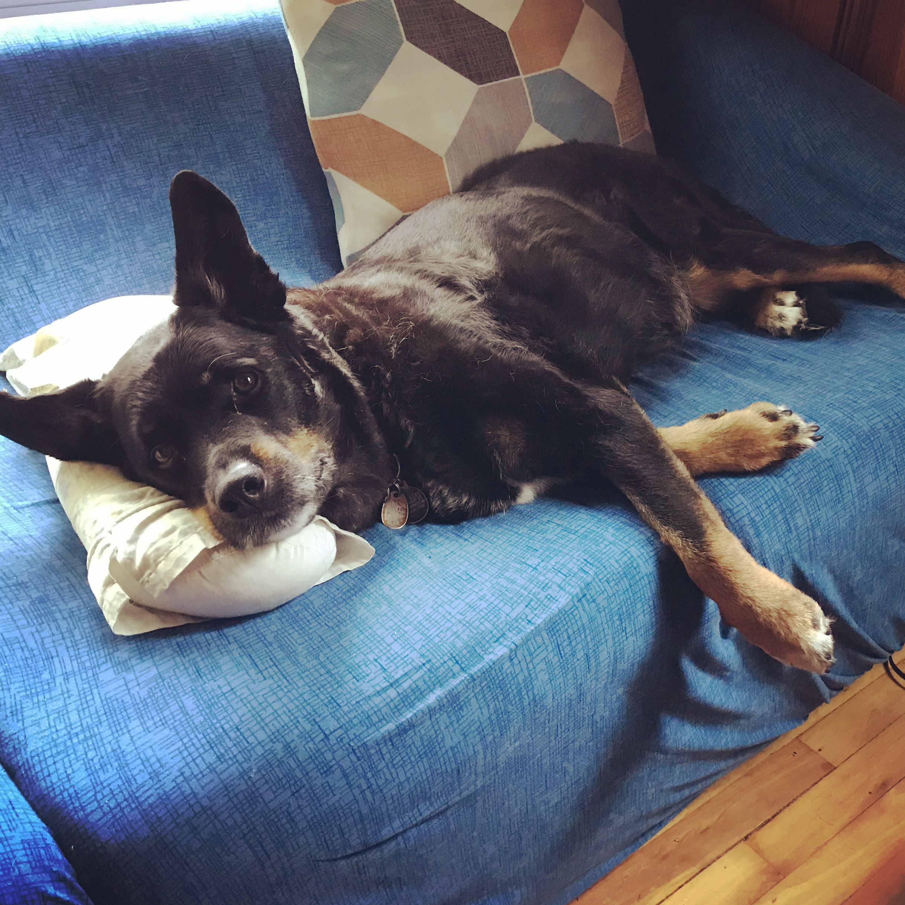

I adopted Naomi as 5 month old puppy in 2010 from the Washington Animal Rescue League, in Washington DC. 
Naomi is a perfect Rottweiler mix, who enjoys laying in the sun and pleasing her humans. 
I adopted Teo as a 3 month old puppy in 2014 from the Pima County Animal Shelter, in Tucson, AZ. 
Teo is an unknown mix (Rhodesian Ridgeback?), who enjoys barking at squirrels and counter-surfing.

<table><tr>
<td>  </td>
<td>  </td>
</tr></table>

See their [Instagram](https://www.instagram.com/teomi2020/) account for more pictures!

